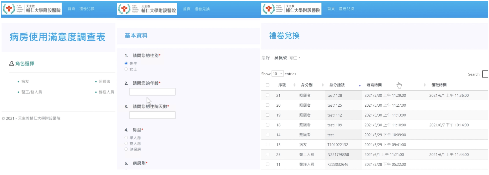

# Hospital Ward Satisfaction Survey System

- [繁體中文版](README_zh.md)
- A Hospital Ward Satisfaction Survey System built with ASP.NET MVC 5.



## System Requirements

- IDE: Visual Studio 2019 or 2022
- Database (if used): SQL Server / SQL Server Express / LocalDB


## Project Structure
```bash
MWsurvey/
├─ Controllers
│  ├─ HomeController.cs     # Defines the site’s home controller; provides Index() to return the home view
│  └─ SurveyController.cs   # Handles the entire survey flow (load questions/options by category, validate user, save responses, and finally show a success page)
├─ Models                   # Auto-generated files
├─ Views
│  ├─ Home                  # Home page
│  ├─ Shared                # Shared pages, e.g., error page
│  └─ Survey                # Survey pages for each user category
└─ ...
```
